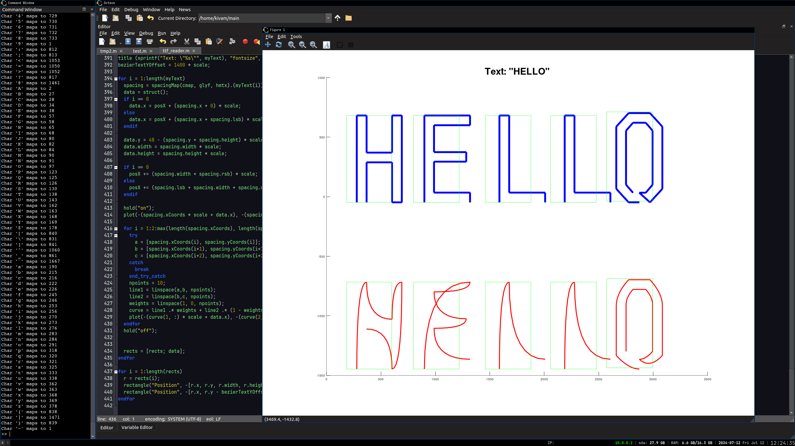

Lots of code copied from https://tchayen.github.io/posts/ttf-file-parsing and https://www.youtube.com/watch?v=SO83KQuuZvg

Change the `filename` variable in `ttf_reader.m` to whatever .ttf file you want, I've only tried `JetBrainsMono-Regular.ttf`

Font shown in screenshot: https://www.jetbrains.com/lp/mono

